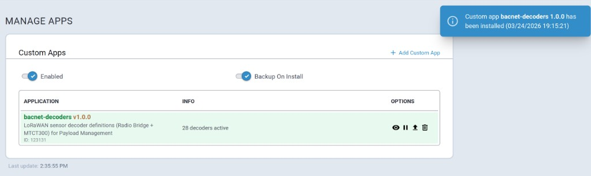
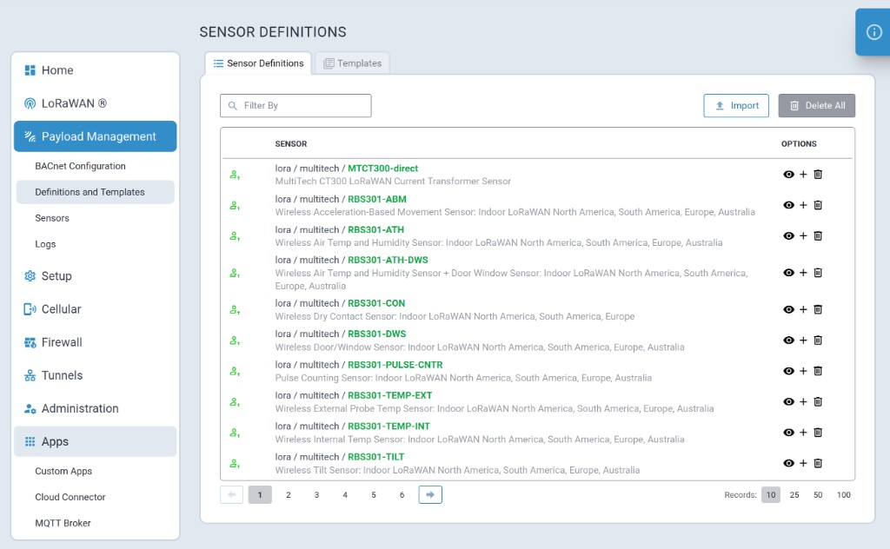

# Technical Information

Technical resources, reference documents, and tooling for MultiTech LoRaWAN sensors.

## Contents

| File / Folder | Description |
|---------------|-------------|
| `BACNet.zip` | Radio Bridge RBS 301, 304, 306 series — decoder definitions (JSON) and JavaScript decoders for Payload Management |
| `MTCT300_direct.zip` | MultiTech CT300 current transformer — ES5-compatible decoder |
| `TTN_decoders.zip` | The Things Network decoder reference files |
| `MessagesLink_V5.xlsx` | Uplink and downlink message reference for Radio Bridge sensors |
| `Sensor Battery Estimator Gen 3.xlsx` | Battery life estimator for Gen 3 sensors |
| `bacnet-app/` | mPower custom app that imports the decoder definitions into Payload Management |

## Sensor Decoder Custom App

The `bacnet-app/` directory contains an mPower custom app that imports LoRaWAN sensor decoder definitions into Payload Management via `scada-cli`. Once installed, the gateway can decode uplink payloads from the supported sensors and expose them over BACnet.

**Supported sensors:**

| Source | Sensors | Decoder Pairs |
|--------|---------|---------------|
| `BACNet.zip` | Radio Bridge RBS 301, 304, 306 series | 27 |
| `MTCT300_direct.zip` | MultiTech CT300 current transformer | 1 |

### Building

```bash
cd bacnet-app
./package.sh            # version auto-detected from git tags
./package.sh 2.0.0      # or specify explicitly
```

Produces `bacnet-app/dist/sensor-decoders_<VERSION>.tgz`, ready to install on an mPower gateway.

Requires `BACNet.zip` and `MTCT300_direct.zip` in the parent directory.

### Installing on a Device

Upload the `.tgz` through the mPower Device Manager UI, or install from the command line:

```bash
app-manager --command install --appid <UUID> --appfile /tmp/sensor-decoders_<VERSION>.tgz
```

The app registers all 28 decoder pairs under `lora/multitech` in Payload Management and restarts the `scada-lorawan-decoder` and `scada-bacnet-out` services.



Once installed, the sensor definitions are available under **Payload Management > Definitions and Templates**:



### Removing

Uninstall via Device Manager or:

```bash
app-manager --command remove --appid <UUID>
```

This purges the imported definitions from Payload Management and restarts the scada services.
